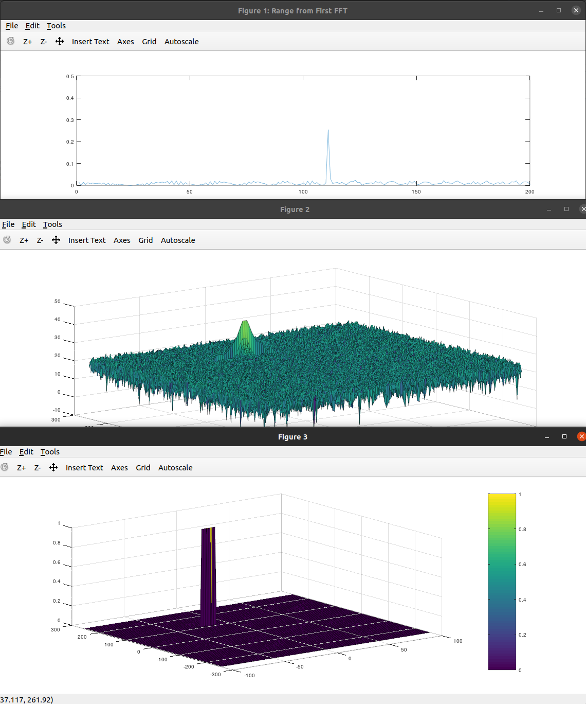

# README.md

### 2D CFAR Implementation:

```matlab
Tr = 8;
Gr = 4;

Td = 8;
Gd = 4;

offset = 10;
noise_level = zeros(Nr/2,Nd);
CFAR = zeros(Nr/2, Nd);

% num training cells
T = (2*Tr + 2*Gr + 1)*(2*Td + 2*Gd + 1) - (2*Gr + 1)*(2*Gd + 1);  
CFAR = zeros(Nr/2, Nd);

% (i,j) is test cell index
for i = (Tr+Gr+1):(Nr/2-Tr-Gr) % loop over row
  
  for j = (Td+Gd+1):(Nd-Td-Gd)  % loop over column
    
    sum_all_cells = sum(db2pow(RDM(i-(Tr+Gr):i+(Tr+Gr), j-(Td+Gd):j+(Td+Gd)))(:));
    sum_test_and_guard_cells = sum(db2pow(RDM(i-Gr:i+Gr, j-Gd:j+Gd))(:));
    noise_level(i,j) = pow2db((sum_all_cells - sum_test_and_guard_cells)/T) + offset;
    
    if RDM(i,j) > noise_level(i,j)
      CFAR(i,j) = 1;
    end
    
  end
  
end
```

1. It is consist of two main for-loops (range is selected in such a way that i,j indices show the location of the test cell):
    1.  **`Tr, Gr`** are respectively the Training Cell size and Guard Cell size in range dimension. This controls the minimum distance that test cell can have from the horizontal edges (i.e.: **`Tr + Gr`**); hence, it controls the row index i.
    2. **`Td, Gd`** are respectively the Training Cell size and Guard Cell size in doppler dimension. This controls the minimum distance that test cell can have from the vertical edges (i.e.: **`Td + Gd`**); hence, it controls the column index j.
2. We loop over all the valid test cells (i.e.: the ones that has minimum possible distance `**= (Tr+Gr, Td + Gd)**` from edges.
    1. For each valid test cell, calculate the signal sum for all cells in the neighborhood (i.e.: Train cells + Guard cells + Test Cell). 
    2. And signal sum for Guard Cells + Test Cell.
    3. Now we can obtain the Signal Sum in All Training Cells by Subtracting the Signal Sum from All Cells - Signal Sum from Guard and Test Cells. 
    4. Next, we calculate the Threshold, by averaging the Signal Sum for All Train Cells (by dividing it to the number of training cells T) and adding the Offset value (which is already in dB).
3. Next, for each iteration (valid Test Cell), check if the Signal in Test Cell is greater than the Threshold (which is stored in `**noise_level**` matrix).
    1. If yes, then Target is present in this cell; hence, put 1 in the corresponding cell in CFAR matrix which is our final output (and previously initialized with zero values so that edge cells that we don’t test them are already put to zero).
4. Finally, we plot the CFAR matrix as surface. 

---

### How to Select number of Train. Guard Cells and Offset value.

1. **Choosing #Guard Cells:** These cells prevent the large signal from leaking into the training cells which used for estimating the noise (separating the Test cell from the Training cells). This can be chosen based on expected spread of target signal which is visible from 2D FFT plot (here 4 to 6). 
2. **Choosing #Train Cells:** If we choose it large, then it may decrease the sensitivity of the radar to fast changes in the noise level. So, it’s a trad-off between noise estimation accuracy and adaptation speed. Hence, we start from a low value and gradually increase it so that estimation is accurate enough to filter out the noise and detect the targets while it’s fast enough to adapt to changing noise levels (usually more than two times the number of Guard Cells at least = 8 to 12). 
3. **Choosing the Offset:** It’s based on the trade-off between missed detections and false alarms. If it’s large the number of false alarms would reduce but also the number of undetected targets.  So, start from low value and gradually increase it until we have a good balance (here: 10 dB). 

---

### How to suppress the non-thresholded cells at the edges:

The cells at the edges are not compared to the threshold due to the lack of supporting Train and Guard Cells which could lead to off estimations. Hence, as suggested by the project description those cells set to 0 by initializing the CFAR matrix with zeros and then only updating the corresponding Test cell values in the for-loops when bigger than the calculated Threshold.

---
### Results:
